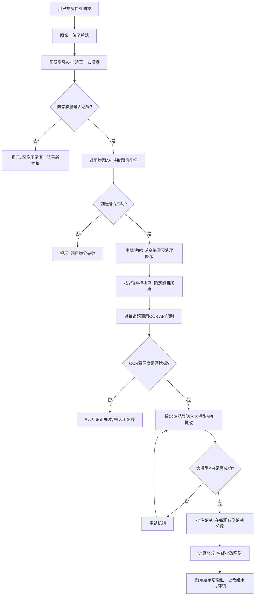

# 基于大模型的批改系统
## 一、项目需求分析
### 1. 项目介绍
#### 1.1. 项目背景
在中小学教育中，作业批改是教学环节中的重要组成部分，但传统的人工批改方式存在以下问题：
效率低：教师需要花费大量时间批改重复性作业
反馈慢：学生无法及时获得作业反馈
工作负担重：尤其是批改客观题、基础计算题时，机械劳动占比高
随着大模型技术和计算机视觉技术的发展，智能批改系统成为缓解上述问题的可行方案。
#### 1.2. 项目目标
本项目旨在开发一个基于大模型的中小学作业批改系统，实现以下目标：
自动化批改：学生通过摄像头拍摄纸质作业，系统自动完成批改并给出评分
智能识别：利用阿里云教育场景API完成试卷切题和题目OCR识别
准确反馈：调用大模型API对题目内容进行智能判断，并在原图上生成批注
易于使用：提供简洁的Web界面，支持上传、批改、结果查看
#### 1.3. 技术选型
| 技术领域 | 选型方案 |
| :--- | :--- |
| 后端框架 | Python + Flask |
| 图像预处理 | 阿里云/百度云图像增强API |
| 切题与OCR | 阿里云 RecognizeEduPaperCut + RecognizeEduQuestionOcr |
| 大模型 | 通义千问 / GLM / DeepSeek API |
| 前端 | HTML + CSS + JavaScript（Flask模板） |
| 并发处理 | 请求队列 / 限流机制 |
### 2. 需求分析
#### 2.1 功能需求
1. **作业图像采集**
- 调用手机或电脑摄像头
- 拍摄纸质作业
2. **图像上传与预处理**
- 将拍摄图像上传到后端
- 调用图像扫描类API（百度云/腾讯云/阿里云，利用每月免费额度）实现：
  - 方向矫正
  - 去模糊 / 图像增强
  - 图像切割等基础清理
3. **图像处理（切题 + OCR识别）**
- 调用阿里云的 **RecognizeEduPaperCut-试卷切题API** 完成切题
- 调用阿里云的 **RecognizeEduQuestionOcr-题目识别API** 来完成题目的OCR识别
4. **作业批改**
- 调用大模型API对识别出的题目内容进行智能批改
- 根据批改结果在原题位置生成批注（如错误标记、正确结果提示）
- 自动计算并给出本次作业的总评分
5. **展示界面**【是否需要flask，还是利用python自带图形库】
- 提供简洁的Web页面，至少包含：
  - 功能按钮（上传 / 批改）
  - 作业上传区
  - 作业切分结果展示（显示切割框 + 题目数量）
  - 作业批改结果展示
  - 评语与评分展示
#### 2.2 异常处理需求
- 图像质量过差（如严重模糊，曝光不足，图像无法正常被扫描类api实现），需提示“图像不清晰，请重新拍摄”
- 切题api返回异常，需提示“题目切分失败，请检查图像（或切题api是否正常）”
- 若OCR识别置信度过低，系统应标记该题为“识别失败，需人工复核”
- 大模型api调用失败，需要有重试机制
#### 2.3 技术约束
- 切题与OCR功能依赖阿里云教育场景API
- 批改功能依赖外部大模型API（如通义千问 / GLM / DeepSeek）
- 系统需具备稳定网络访问能力
- 优先使用API免费额度，降低项目成本
#### 2.4 非功能需求（性能要求）[商量决定]
**并发处理能力**
- 系统需支持多用户同时提交作业批改请求
- 应设计合理的并发处理机制（如异步任务队列、请求限流等）
- 在高并发场景下，保证系统稳定运行，避免因请求堆积导致服务崩溃
**响应时间要求**
- 单次作业批改（从上传到结果返回）在正常负载下不超过 15 秒
- 大模型API调用需设置合理超时时间（建议 5-10 秒）
**可扩展性**
- 系统架构应考虑水平扩展能力，以便后续增加更多API额度或服务节点来提升并发上限
**资源优化**
- 对频繁调用的API结果可考虑缓存机制（如同类题目答案），减少重复调用开销
#### 2.5 技术选型
| 层次 | 技术方案 |
| :--- | :--- |
| Web框架 | Flask（轻量级，适合快速开发） |
| 前端 | HTML + CSS + 原生JavaScript |
| 图像预处理 | 阿里云/百度云图像增强API |
| 切题 | 阿里云 RecognizeEduPaperCut |
| OCR | 阿里云 RecognizeEduQuestionOcr |
| 大模型 | 通义千问 API / DeepSeek API |

## 二、项目分析与设计
### 1. 本项目需要解决的关键技术问题
1. **图像采集与预处理的质量保障**
   - 摄像头拍摄的图像可能存在倾斜、模糊、阴影、反光等问题
   - 需要调用图像增强/矫正API，并判断是否达到可识别标准
2. **试卷切题与题目区域定位** ⭐
   - 阿里云 `RecognizeEduPaperCut` 返回每道题的位置坐标（四个角点）
   - 需要解析坐标信息，按Y轴排序确定题目顺序
   - 将坐标映射回原图，用于后续分数批注的定位
3. **OCR识别与答题内容提取**
   - 需区分“题干”与“学生答案”
   - 识别结果可能存在错字、漏字，影响大模型批改
4. **大模型批改的准确性与稳定性**
   - 大模型可能产生“幻觉”（错误判断）
   - 同一题目多次调用结果可能不一致
   - 需设计提示词工程 + 结果校验机制
### 2. 功能模块划分
| 模块名称 | 功能说明 |
| :--- | :--- |
| 图像采集模块 | 调用摄像头拍照或上传本地图片 |
| 图像预处理模块 | 调用阿里云/百度云图像增强API，进行矫正、去模糊，同时记录变换参数 |
| 切题模块 | 调用阿里云 `RecognizeEduPaperCut` 切分题目，获取每道题的坐标信息 |
| 坐标映射模块 | 将切题API返回的坐标映射回预处理后的图像，按Y轴排序确定题目顺序 |
| OCR识别模块 | 调用阿里云 `RecognizeEduQuestionOcr` 识别题目内容 |
| 大模型批改模块 | 调用大模型API（通义千问/GLM/DeepSeek）进行批改 |
| 批注与评分模块 | 根据坐标映射结果，在每道题右侧绘制分数批注，计算总分 |
| 展示模块 | Web界面展示上传、切题框、批改结果 |
| 并发控制模块 | 队列/限流，支持多用户请求 |
### 3. 系统流程设计
#### 3.1.主流程
1. 用户通过摄像头拍摄作业图像
2. 图像上传至后端
3. 调用图像增强API进行矫正、去模糊，记录变换矩阵
4. 调用切题API，获取每道题的位置坐标
5. 坐标映射：将API返回的坐标通过逆变换映射回预处理后的图像
6. 题目排序：按每个题目区域的Y轴坐标（上边缘）排序，确定题目顺序
7. 对每道题调用OCR API，识别题干和答案
8. 将OCR结果送入大模型API进行批改，获取每题得分
9. 批注绘制：在每道题右侧（X坐标取题目区域右边界+偏移量）绘制分数
10. 计算总分，生成最终批改图像
11. 前端展示切题框、批改结果和评语
#### 3.2.坐标映射与批注详细说明
**坐标处理流程：**
切题API返回坐标(x1,y1,x2,y2...)
↓
记录预处理变换（旋转、缩放、裁剪）
↓
逆变换计算 → 映射回当前图像坐标
↓
计算每道题的：中心Y / 上边缘Y
↓
按Y坐标排序 → 得到题目顺序
↓
批注位置 = (题目右边界 + 20px, 题目上边缘 + 10px)
↓
在原图上绘制分数（如"5分"）
#### 3.3.流程图

